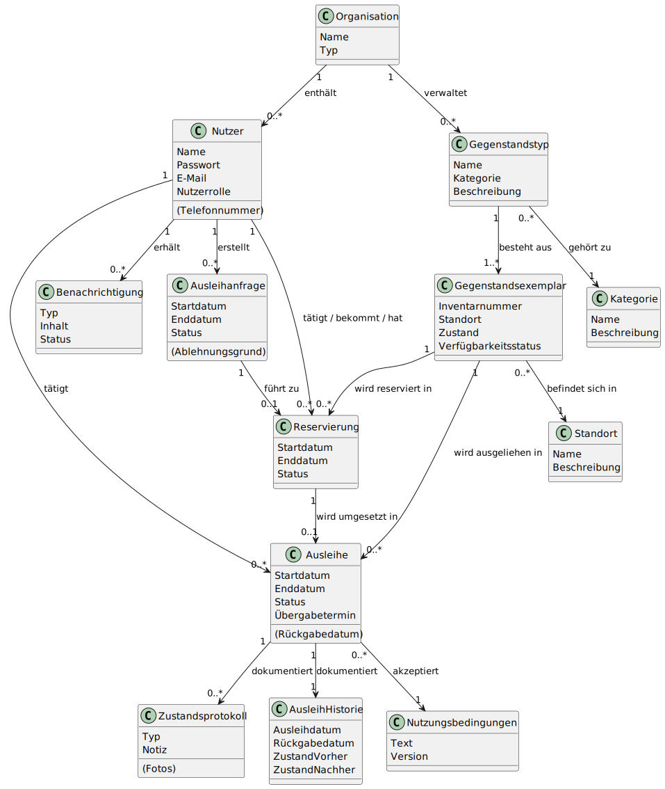

= Sprint-Review 2: {project-name}
include::../_includes/default-attributes.inc.adoc[]

Bitte gebt uns zu den beiden Themen-Gebieten jeweils eine Rückmeldung.
Dargestellt sind die zentralen Entscheidungen bzw. Erkenntnisse aus diesem Sprint.

== 1. Domain-Entscheidungen

[plantuml, domain-model, svg]

Die Anwendung von Leihliste erfolgt innerhalb einer *Organisation*. Dies kann eine WG, eine Hochschule oder ein Unternehmen sein. 

Jeder *Nutzer* hat genau eine bestimmte Rolle: Verleiher, Ausleiher oder Admin. 

Die ausleihbaren *Gegenständstypen* (z.B. Mikroskop Typ XYZ) werden sortiert nach *Kategorie* (z.B. Mikroskope) dargestellt. Zu einem *Gegenstandstypen* können mehrere *Gegenstandsexemplare* gehören. Der Verleih und der Standort (Abhol-/Rückgabeort) bezieht sich immer auf ein konkretes Exemplar (z.B. Mikroskop XYZ Nr. 1).

Beim Ausleihen wird eine *Ausleihanfrage* für diesen Gegenstandstypen an alle Verleiher diesen Gegenstandstypen erstellt. Die erste Genehmigung dieser Anfrage führt zu einer *Reservierung* konkreter GEgenstandsexemplare. Wenn die Ausleihende das Gegenstandexemplar abholt beginnt die *Ausleihe* und endet mit *Rückgabe*.

Alle Beteiligten bekommen Mail-*Benachrichtigungen*, dass sie in Leihliste eine Aktion veranslasst haben (z.B. Ausleihafrage gestellt, Antwort auf Ausleihanfrage bekommen) oder eine Interaktion vornehmen müssen (Ausleihanfrage bestätigen oder ablehnen, Gegenstandsexemplar zurückgeben).

Alle getätigten Ausleihen werden in einer *Ausleihhistorie* gespeichert. Dazu können auch *Zustandsprotokoll* bei Übergabe bzw. rücknahmen gehört sowie *Nutzungsbedingungen*, die mit der Ausleihe akzeptiert wurden.

=== Fragen

- Ist diese Ablauf für dich schlüssig? +
- Siehst du Widersprüche in dem Konzept oder Vereinfachungs-Potential? 

== 2. Architektur-Entscheidungen

[plantuml, "{diagramsdir}/system-context", svg]
....
@startuml
' source: https://github.com/plantuml-stdlib/C4-PlantUML
' C4 Model
!include <c4/C4_Context.puml>

' Images
!include <office/Users/user.puml>
!include <office/Users/mobile_user.puml>^
!include <c4/C4_Container.puml>

LAYOUT_WITH_LEGEND()

skinparam rectangle {
  BackgroundColor White
  BorderColor Black
  BorderStyle dashed
}

title  Container Diagram – [Leihliste]

Person(user, "Nutzer:in", "Verleiher/Ausleiher - Verwendet das System über Web oder Mobile")
Person(admin, "Administrator:in", "Verwaltet und konfiguriert das System")

rectangle "Leihliste\n<<System>>" as system {
  Container(web, "Web-Frontend", "React - UI für Suche, Reservierung, Ausleihe")
  Container(api, "Backend API", "Domänenmodule")
  ContainerDb(db, "Datenbank", "MariaDB - Persistente Datenhaltung des Systems")
  }

/'System_Ext(ext1, "Externer Dienst\n[z.B. Cloud-Speicher]", "NextCloud, HTW-Dateisystem - speichert Dokumente und Bilder")'/
System_Ext(ext2, "Externer Dienst\n[E-Mail-Server]", "SMTP-Mailserver - Versand von Benachrichtigungen")
/'System_Ext(ext3, "Externer Dienst\n[z.B. Kalender-API]", "Google-Kalender - Reservierungen/Ausleihen in Nutzer-Kalender exportieren")'/
/'System_Ext(ext, "Externer Dienst\n[z. B. LDAP / SSO]", "über Hochschule - Authentifizierung und Identitätsverwaltung")'/

Rel(user, web, "nutzt", "Web / Mobile")
Rel(admin, web, "verwaltet")
Rel(web, api, "ruft auf", "JSON/HTTPS")
Rel(api, db, "liest/schreibt", "SQL")
/'Rel(api, ext1, "lädt Fotos & Dokumente hoch/herunter", "WebDAV / HTTPS")'/
Rel(api, ext2, "sendet Benachrichtigungen über", "SMTP")
'Rel(api, ext3, "exportiert Termine/Buchungen", "iCal/RestAPI")

@enduml
....

1) Nutzer interagieren mit Leihliste über ihren Browser oder eine Desktop-Verknüpfung. Dafür bauen wir die Anwendung als *Progressive Web App*, die palttformunabhängig im Browser funktioniert, aber auch lokal installiert werden kann. 

2) Die Anwendung besteht aus 3 Hauptkomponenten: Für das *Frontend* nutzen wir JavaScript mit React, für das *Backend* Python mit Django und die *Datenbank* zum Abspeichern der Nutzer, Gegenstände, Interaktionen und Historie eine relationale Datenbank mit MariaDB. 

3) Damit sich die einzelnen Komponenten (auch während der Entwicklung) nicht gegenseitig stören können, werden diese mit *Docker Compose* in einzelnen Container separiert.

4) Zum Versand der Benachrichtigungen nutzen wir einen externen *SMTP-Mail-Server*, z.B. von einer gmx-Adresse oder einem Mailaccounts der Organisation.

5) Zur Vereinfachung der Ausleihe und Rückgabe hat jedes Gegenstandsexemplar eine eindeutige ID, welche auch über eine aufgeklebten *QR-Code* gescannt werden kann. Diese können vom System selbst erstellt werden.

6) Damit das Backend nicht vollumfänglich erreichbar im Netzwerk hängt, schalten wir *nginx als Reverse-Proxy* davor um eine transportverschlüsselte Verbindung sicherzustellen.

7) Zur Vermeidung von Datenbank-Inkosistenzen bei gleichzeitigen Interaktionen mit dem selben Gegenstandsexemplar nutzen wir eine *Optimistic Locking*-Strategie, mit der für jedes Exemplar über einen zusätzlichen Versionsnummern-Eintrag in der Datenbank abgeglichen wird, ob diese Interaktion noch möglich ist oder sich die Versionsnummern bereits geändert hat, weil eine andere Interaktion (durch andere Nutzer) bereits vorgenommen wurde.

=== Fragen

- Sind diese Komponenten und Werkzeuge für dich schlüssig? +
- Siehst du Widersprüche in dem Konzept oder Vereinfachungs-Potential? 
